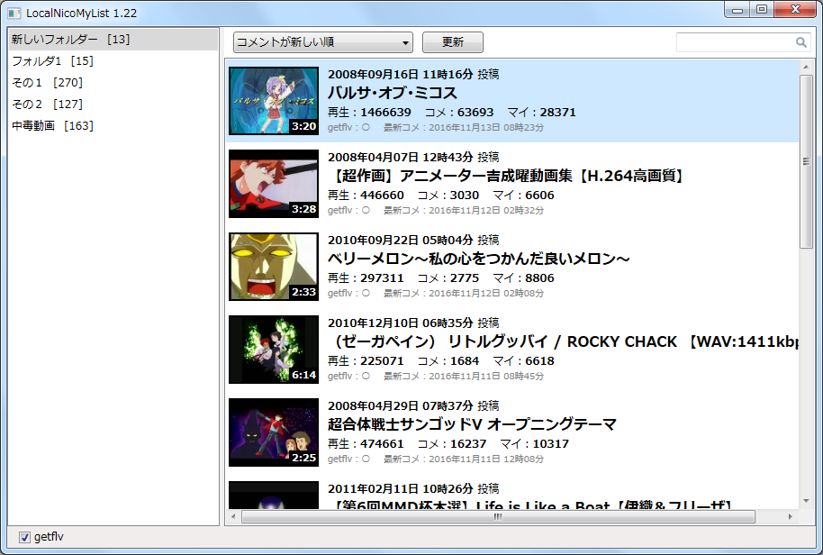

# LocalNicoMyList
ニコニコ動画のマイリスト機能をローカルで行うアプリケーション。

* フォルダ一覧の右クリックメニューからフォルダの追加、削除、名前の変更ができます。
* フォルダ一覧のフォルダをドラッグ＆ドロップすることで並び順を変更できます。
* マイリスト一覧に動画のURL(`http://www.nicovideo.jp/watch/sm～`)をブラウザからドラッグ＆ドロップすると選択されているフォルダにマイリストが追加されます。
* マイリスト一覧にマイリストのURL(`http://www.nicovideo.jp/mylist/～`)をブラウザからドラッグ＆ドロップするとニコニコ動画のマイリストの動画がまとめてマイリストに追加されます。
* マイリストをダブルクリックでブラウザで動画のページを開きます。
* マイリストを選択して右クリックメニューからマイリストを削除できます。
* マイリストをドラッグして、フォルダにドロップすることで、マイリストを別のフォルダに移動、コピーできます。(Ctrlキーを押しながらドロップでコピー)
* 更新ボタンで再生数などの情報を最新の値に更新します。
* マイリスト登録時には最新コメント日時の取得が行われません。時間がたつとgetflvの項目が○になるので、その後、更新ボタンを押すと最新コメント日時が取得されるようになります。
* ステータスバーのgetflvのチェックボックスのON/OFFでgetflvを行うかどうかを切り替えられます。

### getflvについて
getflvはニコニコ動画APIで、最新コメント日時を取得するため必要なスレッドID、メッセージサーバーURLを取得するために使用します。連続してgetflvを行うとアクセス制限が行われて、ブラウザでのニコニコ動画の視聴も一時的にできなくなることがあります。 本アプリでは1秒間隔でgetflvを行い、アクセス制限状態になった場合は30秒待機後、再開します。

### スクリーンショット

### 使用ライブラリ
* DynamicJson (c) neuecc
* SharpHeaderCookie (c) 悠悠閑閑前途遼遠
* SQLite (c) SQLite Development Team
